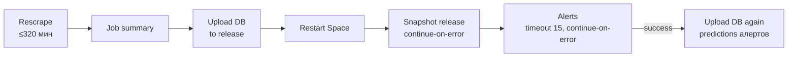

# Design: rescrape-post-steps

Источник требований — [bugfix.md](bugfix.md).

## Overview

Две независимые правки конвейера ночного прохода:

1. **Критический путь первым.** Заливка базы, рестарт Space и снапшот идут сразу
   после сбора; алерты — после них, со своим потолком, и повторная заливка базы,
   если алерты дописали предикты.
2. **Алерты дешёвые по построению.** Вместо полного пользовательского предикта на
   каждый лот — пакетная оценка: одна сборка признаков и по одному вызову
   CatBoost на порцию. Формула цены/интервала/вердикта вынесена в общий хелпер,
   которым пользуются и карточка, и пакет.

Плюс мелкое: `publish_snapshot.py` ретраит временные сбои и не оставляет черновиков.

## Порядок шагов джобы (после фикса)



Бюджет: 320 + ~3 + 15 + ~2 ≈ 340 < 350 мин. Если `Alerts` упал или вышел по
таймауту, `U2` пропускается (`if: steps.alerts.outcome == 'success'`) — в релизе
остаётся база из `U1`, собранное не теряется.

Команда заливки (`VACUUM + gzip + sha256 + gh release upload`) — короткий блок,
повторённый в U1 и U2 без изменений; отдельный скрипт ради двух вызовов был бы
лишним файлом.

## Компоненты и интерфейсы

### `krisha.predict`

```python
def _price_pool(pool: Pool, actual_prices: Sequence[float | None], meta: dict,
                model: CatBoostRegressor) -> list[dict[str, Any]]
```
Одна формула на N строк: `fair = expm1(model.predict(pool))`, интервал —
MultiQuantile + `_apply_cqr` + `finalize_interval`, вердикт — по интервалу или
плоский ±10%. Возвращает по строке `{fair_price, fair_low, fair_high, verdict}`
(неокруглённые). `_predict_from_listing` вызывает её для одной строки — поведение
карточки не меняется, код формулы не дублируется.

```python
def predict_listings_batch(listings: list[dict[str, Any]]) -> list[dict[str, Any]]
```
Пакетная оценка для алертов: `build_features(pd.DataFrame(listings), ...)` → один
`Pool` → `_price_pool`. Возвращает по лоту `{listing_id, fair_price,
fair_price_low, fair_price_high, verdict, diff_pct, model_version}` — округление
и `diff_pct` ровно как в карточке. Без SHAP, подсказок, рынка, аналогов, vision.

### `krisha.db`

```python
def log_predictions(rows: Iterable[dict], conn: sqlite3.Connection | None = None,
                    db_path=DB_PATH) -> int
```
`executemany` в `predictions` одной транзакцией, те же колонки, что
`log_prediction`. Долговечный JSON-лог не пишет (пакетные предикты — не
пользовательские, см. docstring `prediction_log`).

### `krisha.alerts.find_good_deals`

Окно `new_listings()` режется на порции по `ALERT_BATCH_SIZE = 500` (память
признаков ограничена), каждая порция — `predict_listings_batch`, затем
`log_predictions` одной транзакцией. Строка, на которой пакет упал, не должна
ронять весь проход: при исключении порции — фолбэк на поштучную пакетную оценку
этой порции (`predict_listings_batch([listing])`), кривая строка пропускается с
warning, как раньше.

### `.github/workflows/rescrape.yml`

Новый порядок (см. схему), `Alerts` получает `id: alerts` и `timeout-minutes: 15`,
новый шаг `Upload DB again (predictions алертов)` с
`if: steps.alerts.outcome == 'success'`.

### `scripts/publish_snapshot.py`

- `publish()` становится идемпотентным: заметки дописываются, только если секции
  ещё нет в теле релиза; в конце — `_ensure_published(tag)` (`gh release edit
  --draft=false`, если релиз черновик).
- `main()` оборачивает `publish()` в до 3 попыток с паузой 10 → 30 с
  (`PUBLISH_RETRY_WAITS`). Каждая попытка заново проверяет `release_exists`, так
  что вторая после полусозданного черновика идёт веткой «дописать + опубликовать».

## Error handling

| Сбой | Поведение |
|---|---|
| `Alerts` дольше 15 мин | шаг убит по таймауту, `continue-on-error`, повторная заливка пропущена; база уже в релизе |
| Исключение в порции пакета | порция переоценивается по одному лоту, кривые лоты пропускаются с warning |
| Модель/мета недоступны | `find_good_deals` бросает — шаг красный, база уже залита (было: база не заливалась) |
| HTTP 5xx на `gh release create/upload` | до 3 попыток; после исчерпания — exit 1, как раньше (шаг вторичный) |

## Решения

### D1. Пакетная оценка вместо «облегчённого» поштучного предикта
- **Контекст:** алертам нужны только цена/интервал/вердикт; 0.5–0.75 с на лот
  уходят на SHAP, подсказки, рынок, аналоги и коммит на каждый лот.
- **Варианты:** (1) флаг `lite=True` у `predict_from_listing` — ~20–40 мс на лот,
  тот же код признаков; (2) пакет — одна сборка признаков и один вызов CatBoost на
  500 лотов.
- **Решение:** (2). Порядок выигрыша — минуты против секунд, а эквивалентность
  доказывается тестом (все категориальные признаки строковые, `build_features` —
  построчный, без выбрасывания строк). Общий хелпер `_price_pool` исключает дрейф
  формулы между карточкой и пакетом.

### D2. Переупорядочить шаги + повторная заливка, а не только таймаут на Alerts
- **Варианты:** (1) оставить порядок, дать `Alerts` таймаут — 320 + 15 + заливка ≈
  338 мин при запасе 12 мин и всё ещё зависимость критического пути от вторичного;
  (2) критический путь первым, алерты после, повторная заливка при успехе.
- **Решение:** (2): заливка базы больше не зависит от алертов вовсе; цена — лишние
  ~1–2 мин на повторную заливку и то, что снапшот дня не содержит предиктов алертов
  этого дня (они приедут в `db-latest` и в снапшот следующего дня).

### D3. Ретрай снапшота целиком, а не отдельных `gh`-вызовов
- **Решение:** ретраить `publish()` целиком — после полусозданного черновика
  повтор `release create` упал бы на «уже существует»; целиковый повтор сам уходит
  в ветку «дописать + опубликовать». Требует идемпотентности заметок (проверка
  наличия секции).

Журнал решений `.kiro/decisions` + `scripts/decisions.py` в этом репозитории не
заведён — решения зафиксированы здесь.

## Тестовая стратегия

| Что | Тест |
|---|---|
| Эквивалентность пакет/карточка на реальной модели (AC-4.1) | `tests/test_alerts_batch.py` |
| `find_good_deals` не вызывает `predict_from_listing`, пишет N строк (AC-3.1, AC-5.1) | `tests/test_alerts_batch.py` |
| Порядок шагов и таймаут `Alerts` (AC-1.1) | `tests/test_rescrape_workflow.py` (разбор YAML) |
| Ретрай и публикация черновика (AC-7.1, AC-7.2) | `tests/test_publish_snapshot.py` |
| Замер на реальной базе (NFR-1) | ручной прогон `find_good_deals` на свежей `db-latest`, цифры — в tasks.md |
