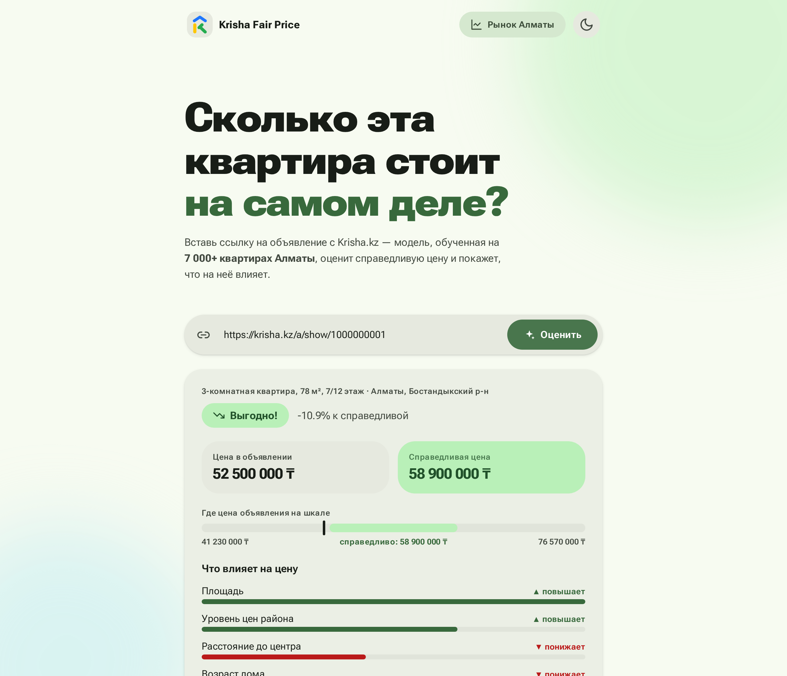
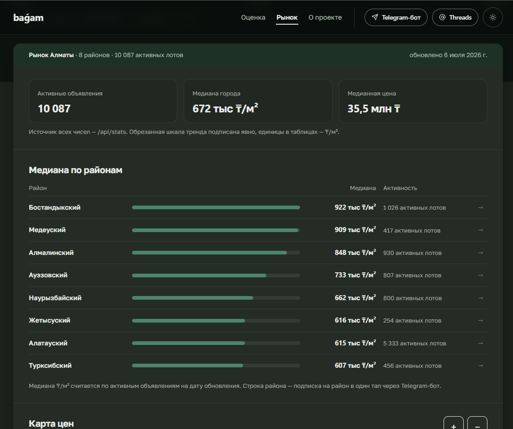

<div align="center">

<picture>
  <source media="(prefers-color-scheme: dark)" srcset="docs/logo-dark.svg">
  
</picture>

**baǵam — справедливая цена квартиры в Алматы: вставьте ссылку на объявление и проверьте, цена выгодная, рыночная или завышенная**

[](https://github.com/Dex719/krisha-fair-price/actions/workflows/ci.yml)


**[🚀 Сайт](https://dex719-krisha-fair-price.hf.space)** · **[📊 Рынок Алматы](https://dex719-krisha-fair-price.hf.space/stats)** · **[ℹ️ О проекте](https://dex719-krisha-fair-price.hf.space/about)** · **[🤖 Telegram-бот](https://t.me/fairprice_kzbot)** · **[🧵 Threads](https://www.threads.net/@bagam.kz)**



</div>

---

## ✨ Что умеет

1. Вставляешь ссылку на объявление о продаже квартиры в Алматы (или просто текст объявления — в боте).
2. Сервис скачивает объявление и извлекает ~20 признаков (площадь, комнаты, этаж, возраст дома, район, ЖК, координаты, расстояние до центра…).
3. CatBoost-модель считает *справедливую* рыночную цену и сравнивает с ценой в объявлении.
4. Ответ: вердикт (`ВЫГОДНО` / `В РЫНКЕ` / `ПЕРЕПЛАТА`), отклонение в %, интервал цены и главные факторы с пояснениями, которые тянут цену вверх или вниз (SHAP).
5. Бонусы: медианный срок до снятия похожих объявлений («похожие уходят за ~N дней»), слежка за ценой в один тап из отчёта (`/track` в боте — алерты при изменении цены и снятии), подписка на район со страницы рынка, живой дашборд рынка Алматы с картой цен.

## 🤖 Telegram-бот и Mini App

Тот же сервис доступен как **Telegram-бот [@fairprice_kzbot](https://t.me/fairprice_kzbot)**: отправьте ссылку или текст объявления, включите /track для слежки за ценой и /alerts для выгодных лотов по фильтрам. Mini App открывает полноценный интерфейс сайта. Сайт связан с ботом deep-link'ами: кнопка «Следить за ценой» включает слежку за конкретным лотом, строка района на странице рынка — подписку на район.

Бот работает на том же FastAPI через webhook (`POST /tg/webhook`) — отдельный сервер не нужен. Для своего деплоя достаточно задать `TELEGRAM_BOT_TOKEN`; webhook регистрируется при старте автоматически, а health-пинг раз в час проверяет его и чинит, если слетел.

## 📈 Модель

Обучена на реальных объявлениях со всех 8 районов Алматы (вежливый resumable-краулер → SQLite). База пополняется ежедневным рескрейпом — свежие цены, новые объявления, отметки о снятии с продажи — а модель еженедельно переобучается на растущей выборке. Актуальный размер базы — на странице [Рынок](https://dex719-krisha-fair-price.hf.space/stats). Параллельно копится отдельная база аренды — под будущую модель арендной цены и калькулятор «купить vs снимать».

| Метрика | CatBoost | Бейзлайн (медиана ₸/м² по району × комнатам) |
|---|---|---|
| MAE | **4.15 млн ₸** | 9.47 млн ₸ |
| MAPE | **7.7%** (95% CI 7.3–8.1%) | 16.6% |
| MdAPE | **5.4%** | 12.8% |
| R² | **0.912** | 0.713 |

Метрики модели от 2026-08-09 на **временно́м holdout**: тест — объявления, впервые увиденные за последние 14 дней (4 123 лота), train — всё, что раньше (24 538), с purge перевыставлений из train и дедупом перевыставлений. Покрытие интервала цены на тесте ~79% при цели 80%. Живая медианная ошибка текущей модели публикуется в `/api/health`.

- Таргет: `log1p(price)`, нативные категориальные признаки (район, микрорайон, ЖК, тип дома).
- Пространственные признаки: медиана ₸/м² по гексагонам H3 (res 7 и 8), считается только на train и снапшотится в `models/spatial_ref.json`.
- Интервал цены: единая MultiQuantile-модель (`models/model_quantile.cbm`, квантили 10%/90%) с конформной калибровкой (CQR) — покрытие на тесте ~79% при цели 80%.
- Объяснимость: SHAP-факторы на каждый прогноз + глобальный отчёт в [`reports/shap_summary.png`](reports/shap_summary.png).
- Еженедельное переобучение с гейтом качества: новая модель заезжает, только если не хуже старой на свежем тесте.

## 📉 Как менялась модель

| Дата | Выборка (n_train) | Что изменилось | MAPE | R² | Методика оценки |
|---|---|---|---|---|---|
| 2026-06-12 | 4 868 | Первая модель CatBoost: 23 фичи — параметры квартиры, координаты, ₸/м² по районам/микрорайонам | 10.5% | 0.86 | наивный random 80/20 |
| 2026-06-12 | 5 637 | Датасет вырос до 7 050 объявлений — ретрейн на прежних фичах (MAPE временно просел) | 10.6% | 0.78 | наивный random 80/20 |
| 2026-06-12 | 5 637 | Фичи из raw_params: ремонт, санузел, мебель, парковка, балкон, охрана | 10.0% | 0.81 | наивный random 80/20 |
| 2026-06-12 | 5 637 | Справочник ЖК: застройщик, класс жилья, год сдачи, число квартир в комплексе | 9.9% | 0.84 | наивный random 80/20 |
| 2026-06-12 | 5 637 | Гео-фичи из OpenStreetMap: восемь дистанций до POI (метро, школа, парк, магистраль…) и walk score | 9.8% | 0.80 | наивный random 80/20 |
| 2026-07-02 | 5 600 | H3-гексагоны ₸/м² (res 7/8) + первая честная валидация: дедуп перевыставлений, сплит по зданиям | 9.5% | 0.77 | dedup + GroupShuffleSplit по зданиям |
| 2026-07-02 | 5 600 | Интервал цены: квантильные модели 10%/90% + CQR (покрытие на тесте 78.9% при цели 80%); вердикт бота опирается на интервал | 9.5% | 0.77 | dedup + GroupShuffleSplit по зданиям |
| 2026-07-14 | — | Time-based сплит и фиксы утечек в коде: тест — последние 14 дней по first_seen, purge перевыставлений из train, устранена утечка CQR-калибровки (прод переобучён только 02.08) | — | — | time-based + purge |
| 2026-07-14 | — | Единая MultiQuantile-модель вместо двух квантильных — квантили больше не пересекаются (код) | — | — | time-based + purge |
| 2026-07-27 | — | Валидность измерения: кластерный бутстреп CI для MAPE по зданиям, TVD-гарды представительности теста, mdape (код) | — | — | time-based + purge + гарды валидности |
| 2026-08-02 | 18 979 | Первый weekly retrain на честном пайплайне; датасет втрое больше (~23.5k строк после дедупа) | 8.5% | 0.906 | time-based holdout + purge + dedup |
| 2026-08-09 | 24 538 | Weekly retrain — текущая модель: MAPE 7.7% [95% CI 7.3–8.1], mdape 5.4% | 7.7% | 0.912 | time-based holdout + purge + dedup |

Числа между эпохами напрямую не сравнимы: методика валидации менялась трижды (наивный random 80/20 → дедуп + групповой сплит по зданиям → time-based holdout → time-based + гарды валидности измерения), и ранние цифры получены на более лёгком сплите, а датасет за это время вырос с ~7k до ~29k строк — так что снижение MAPE 9.5% → 7.7% не чистый прогресс модели. История еженедельных ретрейнов копится с 2026-08-02 в `models/metrics_history.jsonl`. Тестовое окно последних 14 дней смещено по районам относительно всей базы (`test_representativeness` в `models/model_meta.json`), поэтому абсолютный MAPE нельзя читать как среднюю ошибку по всему Алматы; сравнение старой и новой модели на одном и том же тесте остаётся честным.

### Все версии на одном тесте

Хронология выше между строками несравнима — поэтому все сохранившиеся в git версии модели прогнаны скриптом `scripts/compare_models.py` на **одном и том же** тесте по методике еженедельного гейта: объявления последних 14 дней до 2026-08-09 (4 123 лота, сплит и purge текущего ретрейна, фичи по картам его train-среза). Полный отчёт — [`reports/model_comparison.json`](reports/model_comparison.json).

| Модель / веха | Дата | Фичей | MAPE тогда* | MAPE | MdAPE | MAE | R² |
|---|---|---|---|---|---|---|---|
| `fd06da4` Первая модель: CatBoost на 6 075 объявлениях | 2026-06-12 | 23 | 10.50% | 10.41% | 7.89% | 5.8 млн ₸ | 0.853 |
| `29cf732` Ретрейн на 7 050 объявлениях (те же 23 фичи) | 2026-06-12 | 23 | 10.57% | 10.44% | 7.89% | 5.6 млн ₸ | 0.869 |
| `b160ff7` +raw_params: ремонт, санузел, мебель, парковка, охрана | 2026-06-12 | 32 | 9.98% | 9.99% | 7.54% | 5.5 млн ₸ | 0.866 |
| `54a3752` +справочник ЖК: застройщик, класс, год сдачи | 2026-06-12 | 36 | 9.86% | 9.76% | 7.21% | 5.3 млн ₸ | 0.869 |
| `b26a657` +OSM POI: метро/школы/парки, walk_score | 2026-06-12 | 45 | 9.81% | 9.67% | 7.30% | 5.3 млн ₸ | 0.879 |
| `c32ed2b` +H3-гексагоны; честная CV (dedup + group split), v0.2.0 | 2026-07-02 | 47 | 9.46% | 9.66% | 7.21% | 5.3 млн ₸ | 0.875 |
| `e7c837e` Weekly retrain 02.08: time-based holdout + purge | 2026-08-02 | 47 | 8.49% | 8.52% | 6.22% | 4.7 млн ₸ | 0.898 |
| **`c244821` Weekly retrain 09.08 (текущий прод)** | **2026-08-09** | **47** | **7.66%** | **7.66%** | **5.44%** | **4.2 млн ₸** | **0.912** |
| Бейзлайн: медиана ₸/м² (район × комнаты) | — | — | — | 16.64% | 12.77% | 9.5 млн ₸ | 0.713 |

\* «MAPE тогда» — метрика из меты каждой эпохи на её **собственном** сплите (методики разные — см. колонку «Методика оценки» в хронологии); остальные колонки — общий тест. Поэтому «MAPE тогда» и MAPE расходиться могут и должны: например, выигрыш `c32ed2b` в хронологии дала смена методики валидации, а на общем тесте она не лучше `b26a657` (9.66% против 9.67%) — главный прирост качества принесли свежие данные еженедельных ретрейнов.

Оговорки (детали — в `caveats` отчёта): общий тест — окно 14 дней лишь формально, 98.7% лотов пришли за три дня 01–03.08, и гарды ретрейна помечают его непрезентативным по районам (TVD 0.238 при пороге 0.2) — абсолютные цифры не «типичная ошибка по рынку Алматы», честно здесь только сравнение эпох между собой. Старые эпохи могли видеть перевыставления тестовых квартир в своём трейне, но фактически таких лотов 36 из 4 123 (0.9%) — на метрики не влияет; у `e7c837e` общий тест почти совпадает с её собственным (3 397 общих лотов), отсюда близость её «MAPE тогда» и MAPE. Все эпохи скорятся с картами ₸/м²/H3 свежего train-среза (как в гейте), так что июньские модели здесь выглядят чуть сильнее, чем были в проде своего времени. Чекпойнт `700ba4b` (02.07, CQR-интервал) в таблицу не включён — это тот же обученный артефакт, что `c32ed2b`.

## 🛠 Стек

`Python 3.11` · `httpx` + `BeautifulSoup4` · `SQLite` · `pandas` · `CatBoost` · `SHAP` · `FastAPI` · `vanilla JS` · собственная дизайн-система baǵam (светлая/тёмная, self-hosted шрифты, без CSS/JS-фреймворков) · `Leaflet` · `pytest` + `GitHub Actions` · `Hugging Face Spaces`

## 🚀 Быстрый старт

```bash
python -m venv .venv && source .venv/bin/activate   # Windows: .venv\Scripts\activate
pip install -e ".[dev]"   # dev включает train-extras (shap, matplotlib)

make crawl        # быстрая проба: ~50 объявлений в data/krisha.db
make crawl-full   # полный обход Алматы (часы — вежливые задержки)
make train        # обучение CatBoost → models/model.cbm + SHAP-отчёт
make api          # http://localhost:8000 — веб-интерфейс + API
make test         # pytest
```

Runtime-деплой (Docker/HF Spaces) ставит только `pip install -e .` — тяжёлые train-зависимости (`shap`, `matplotlib`, `scikit-learn`) вынесены в optional extra `train` и нужны лишь для `make train` и SHAP-отчётов: `pip install -e ".[train]"`.

`requirements*.lock` собраны под Linux (CI/Docker); локальная разработка на Windows/macOS — `pip install -e ".[dev]"`. Docker ставит из `requirements.lock`, чтобы prod и Actions не разъезжались на разных версиях `catboost`/`pandas`/etc. После правки зависимостей в `pyproject.toml` перегенерируй оба лока и закоммить их в том же PR:

```bash
make lock
```

Сбор аренды (отдельная база `data/krisha_rent.db`):

```bash
python scripts/rescrape.py --deal arenda --max-new 1000
```

## 🔌 API

| Метод | Путь | Что делает |
|---|---|---|
| `POST` | `/api/predict` | `{"url": "https://krisha.kz/a/show/..."}` → вердикт, справедливая цена, факторы, срок продажи |
| `GET` | `/api/stats` | срез рынка: районы, ₸/м², распределения цен, тренд по неделям |
| `GET` | `/api/heatmap` | сетка ₸/м² для карты цен (ячейки ~400 м) |
| `GET` | `/api/forecast` | прогноз ₸/м² на 3–6 месяцев (за фича-флагом `FEATURE_FORECAST`, по умолчанию 404) |
| `GET` | `/api/demo` | случайное активное объявление для кнопки «Показать на примере» |
| `GET` | `/api/health` | живость + статус модели, её медианная ошибка и Telegram-webhook |
| `POST` | `/tg/webhook` | апдейты Telegram-бота (защищено секретом) |

Страницы: `/` — оценка, `/stats` — рынок Алматы с картой цен, `/about` — как считается оценка.

## 🗂 Структура проекта

```
src/krisha/
├── scraping/       # вежливый HTTP-клиент (задержки, ретраи), парсеры выдачи и деталей, resumable-краулер, рескрейп
├── features.py     # очистка + фичи (этажность, возраст дома, до центра, карты ₸/м²)
├── train.py        # обучение CatBoost, бейзлайн, честная валидация, SHAP
├── predict.py      # ссылка → вердикт
├── factor_hints.py # подсказки к факторам: живые медианы по сегментам базы
├── market.py       # рыночная статистика: срез по районам, срок до снятия
├── bot.py          # Telegram-бот: webhook → predict → ответ; /track, /alerts, deep-link'и с сайта
├── api/            # FastAPI + статичный фронт
└── db.py           # SQLite: схема, upsert по id, история цен
static/             # фронт на дизайн-системе baǵam (design.css): оценка, рынок, о проекте
tests/              # 488 тестов: парсеры (фикстуры с реальной разметкой), фичи, БД, бот, API, фронт-приёмка, train-smoke, артефакты модели
tests/e2e/          # 34 браузерных e2e (pytest-playwright): герметичные против uvicorn+Chromium и live-smoke
```

E2e-тесты не входят в `make test` (нужен Chromium): `pip install -e ".[dev]" && playwright install chromium`, затем `make test-e2e`. Живой smoke с реальной базой и одним походом на krisha.kz — `pytest -m live` (только вручную).

## 🏷 Версии

Релизы нумеруются по [semver](https://semver.org) `0.MINOR.PATCH`, история — в [CHANGELOG.md](CHANGELOG.md). Текущая версия — в `/api/health`.

## ⚠️ Дисклеймер

Учебный проект. Данные объявлений принадлежат krisha.kz; сбор нарочно щадящий (случайные задержки, без параллельной долбёжки). Прогнозы — оценка, а не финансовый совет. Лицензия кода будет определена отдельно; данные и модели лицензией кода не покрываются.

<div align="center">



</div>
