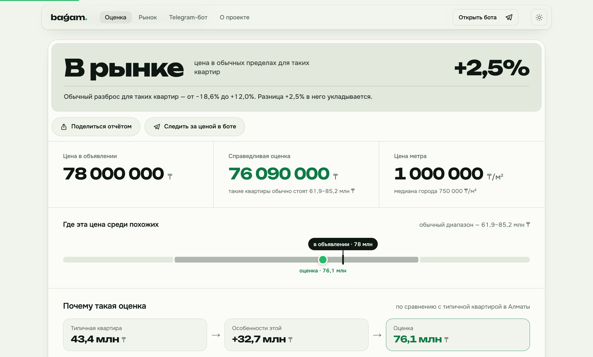
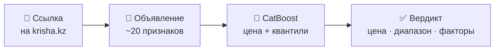
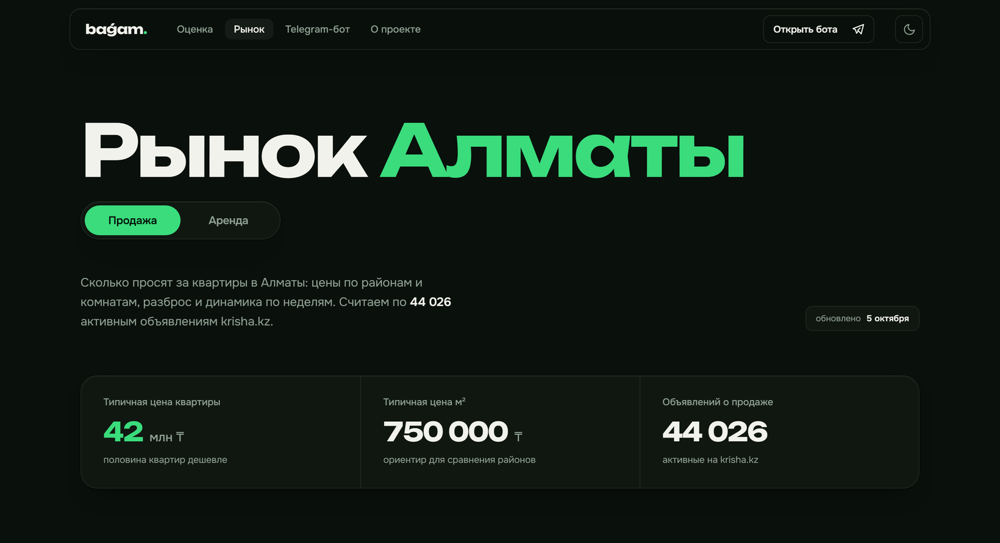

<div align="center">

<picture>
  <source media="(prefers-color-scheme: dark)" srcset="assets/logo-dark.svg">
  
</picture>

**baǵam — справедливая цена квартиры в Алматы: вставьте ссылку на объявление и проверьте, цена выгодная, рыночная или завышенная**

[](https://bagam.info)
[](https://t.me/fairprice_kzbot)
[](https://bagam.info/about)
<br>
[](https://github.com/Dex719/krisha-fair-price/actions/workflows/ci.yml)


**[🚀 Открыть сайт](https://bagam.info)** &nbsp;·&nbsp; **[📊 Рынок Алматы](https://bagam.info/stats)** &nbsp;·&nbsp; **[🏠 Аренда](https://bagam.info/stats?mode=rent)** &nbsp;·&nbsp; **[🤖 Telegram-бот](https://t.me/fairprice_kzbot)** &nbsp;·&nbsp; **[🧵 Threads](https://www.threads.net/@bagam.kz)**



<sub>[Что умеет](#-что-умеет) · [Как работает](#-как-это-работает) · [Точность](#-точность) · [Бот](#-telegram-бот-и-mini-app) · [Данные](#-данные-и-надёжность) · [Быстрый старт](#-быстрый-старт) · [API](#-api) · [Структура](#-структура-проекта)</sub>

</div>

---

## ✨ Что умеет

<table>
<tr>
<td width="50%" valign="top">

**🔎 Оценка по ссылке**<br>
Вердикт «Выгодно», «В рынке» или «Дорого», справедливая цена и обычный диапазон для таких квартир.

</td>
<td width="50%" valign="top">

**🏠 Продажа и аренда**<br>
Тип сделки определяется сам: у аренды своя модель, оценка в ₸/мес и доходность сдачи для продажи.

</td>
</tr>
<tr>
<td valign="top">

**🧩 Почему такая цена**<br>
Главные факторы «за» и «против» с пояснениями человеческим языком (SHAP), похожие объявления и срок продажи.

</td>
<td valign="top">

**📊 Рынок Алматы**<br>
Цены и аренда по районам и комнатам, разброс, динамика по неделям — живые цифры из ежедневного сбора.

</td>
</tr>
<tr>
<td valign="top">

**🤖 Telegram-бот**<br>
Оценка прямо в чате (ссылкой или текстом), слежение за ценой объявления и уведомления о выгодных предложениях.

</td>
<td valign="top">

**🛡️ Подозрительно дёшево**<br>
Сильно ниже рынка и свежее — не зелёное «Выгодно», а предупреждение о возможном мошенничестве.

</td>
</tr>
</table>

## ⚡ Как это работает


```mermaid
flowchart LR
    A["🔗 Ссылка<br/>на krisha.kz"] --> B["📄 Объявление<br/>~20 признаков"]
    B --> C["🧠 CatBoost<br/>цена + квантили"]
    C --> D["✅ Вердикт<br/>цена · диапазон · факторы"]
```

1. Вставляете ссылку на объявление о продаже или аренде квартиры в Алматы — на сайте или в боте (боту можно прислать и просто текст объявления о продаже).
2. Сервис загружает объявление и извлекает признаки: площадь, комнаты, этаж, возраст дома, район, ЖК, координаты, расстояние до центра…
3. Модель CatBoost считает справедливую рыночную цену и обычный диапазон, а затем сравнивает их с ценой в объявлении.
4. Ответ: вердикт, отклонение в процентах, диапазон цены и факторы с пояснениями. Рядом — похожие объявления, срок продажи и кнопка «Следить за ценой» в боте.

## 📈 Точность

<!-- METRICS:BEGIN -->
**Текущая прод-модель — ретрейн 2026-10-04.** Числа берутся из `models/model_meta.json`; на сайте те же метрики живые (`/api/health`), в README их обновляет `scripts/sync_readme_metrics.py`.

| Метрика | Значение |
|---|---|
| MAPE | **7.02%** (95% ДИ 6.89–7.15%) |
| MdAPE | 5.07% |
| MAE | 3.99 млн ₸ |
| R² | 0.9551 |
| Обучено на | 67 842 строк, тест 15 901 |

Временная валидность подтверждена (`temporal_validity: true` в мете).
<!-- METRICS:END -->

Для масштаба: наивный бейзлайн «медиана ₸/м² по району × комнатам» даёт MAPE ~16.5% — модель ошибается вдвое меньше. Покрытие интервала цены на тесте ~80% при цели 80%.

<details>
<summary><b>Под капотом</b> — признаки, интервалы, валидация</summary>

- Таргет `log1p(price)`, нативные категориальные признаки (район, микрорайон, ЖК, тип дома) — всего 47 фичей.
- Пространственные признаки: медиана ₸/м² по гексагонам H3 (res 7 и 8), для метрик считается только на train (без утечки теста), у прод-модели — на всех данных; снапшотится в `models/spatial_ref.json`.
- Интервал цены: MultiQuantile-модель (квантили 10%/90%) с конформной калибровкой (CQR).
- Объяснимость: SHAP-факторы на каждый прогноз + глобальный отчёт [`reports/shap_summary.png`](reports/shap_summary.png).
- Валидация: временно́й holdout (тест — объявления, впервые увиденные за последние 14 дней) с дедупом и purge перевыставлений. После оценки модель переобучается на всех данных, включая тест, — в прод уходит она (на walk-forward стенде −0.3 п.п. MAPE).

</details>

## 📉 Как менялась модель

Методика валидации менялась трижды, поэтому «исторические» метрики эпох напрямую сравнивать нельзя. Все сохранившиеся в git версии модели прогнаны `scripts/compare_models.py` на **одном замороженном тесте** (окно 01–16.08.2026, 5 434 лота, методика еженедельного гейта). Полный отчёт — [`reports/model_comparison.json`](reports/model_comparison.json), история ретрейнов — `models/metrics_history.jsonl`.

| Веха | Дата | Фичей | MAPE | MdAPE | MAE | R² |
|---|---|---|---|---|---|---|
| Бейзлайн: медиана ₸/м² (район × комнаты) | — | — | 16.5% | 12.8% | 9.0 млн ₸ | 0.73 |
| Первая модель `fd06da4`: CatBoost на 6 075 объявлениях | 2026-06-12 | 23 | 10.2% | 7.7% | 5.5 млн ₸ | 0.85 |
| v0.2.0 `c32ed2b`: 47 фичей — +ЖК, OSM POI, H3-гексагоны | 2026-07-02 | 47 | 9.6% | 7.2% | 5.2 млн ₸ | 0.87 |
| Weekly retrain 16.08 `974c893` (последняя веха на этом тесте) | 2026-08-16 | 47 | **7.5%** | **5.4%** | **4.0 млн ₸** | **0.92** |

Главный прирост после июля дали не новые фичи, а данные: еженедельные ретрейны на растущей базе (~7k → ~35k строк после дедупа). Таблица заморожена намеренно и прод не описывает — метрики прода выше, в блоке «Точность».

<details>
<summary>Все 9 чекпойнтов на одном тесте (01–16.08.2026, n=5 434)</summary>

| Модель | Дата | Фичей | MAPE тогда (свой тест) | MAPE | MdAPE | MAE | R² |
|---|---|---|---|---|---|---|---|
| `fd06da4` Первая модель: CatBoost на 6075 объявлениях | 2026-06-12 | 23 | 10.50% | 10.19% | 7.68% | 5.53M ₸ | 0.8532 |
| `29cf732` Ретрейн на 7050 объявлениях (те же 23 фичи) | 2026-06-12 | 23 | 10.57% | 10.20% | 7.68% | 5.38M ₸ | 0.8717 |
| `b160ff7` +raw_params: ремонт, санузел, мебель, парковка, охрана | 2026-06-12 | 32 | 9.98% | 9.80% | 7.38% | 5.28M ₸ | 0.8664 |
| `54a3752` +справочник ЖК: застройщик, класс, год сдачи | 2026-06-12 | 36 | 9.86% | 9.63% | 7.07% | 5.20M ₸ | 0.8656 |
| `b26a657` +OSM POI: метро/школы/парки, walk_score | 2026-06-12 | 45 | 9.81% | 9.57% | 7.20% | 5.12M ₸ | 0.8735 |
| `c32ed2b` +H3-гексагоны; честная CV (dedup + group split), v0.2.0 | 2026-07-02 | 47 | 9.46% | 9.56% | 7.15% | 5.17M ₸ | 0.8710 |
| `e7c837e` Weekly retrain 02.08: time-based holdout + purge | 2026-08-02 | 47 | 8.49% | 8.41% | 6.22% | 4.52M ₸ | 0.8978 |
| `c244821` Weekly retrain 09.08 | 2026-08-09 | 47 | 7.66% | 7.81% | 5.64% | 4.13M ₸ | 0.9135 |
| `974c893` Weekly retrain 16.08 | 2026-08-16 | 47 | 7.58% | 7.51% | 5.41% | 3.95M ₸ | 0.9153 |
| Бейзлайн: медиана ₸/м² (район × комнаты) | — | — | — | 16.48% | 12.79% | 9.02M ₸ | 0.7250 |

«MAPE тогда» — метрика каждой эпохи на её **собственном** сплите (методики разные), остальные колонки — общий тест; расходиться они могут и должны. Чекпойнт `700ba4b` (02.07, CQR-интервал) не включён — это тот же обученный артефакт, что `c32ed2b`.

</details>

## 🤖 Telegram-бот и Mini App

Тот же сервис в Telegram — **[@fairprice_kzbot](https://t.me/fairprice_kzbot)**:

| Команда | Что делает |
|---|---|
| ссылка на объявление | оценка, как на сайте: справедливая цена, диапазон, факторы |
| текст объявления без ссылки | примерная оценка по описанию |
| `/track ссылка` | слежение за объявлением: напишу, если цена изменилась или объявление сняли |
| `/alerts_on 2к до 45млн бостандыкский` | раз в день — новые объявления дешевле оценки, с фильтрами по комнатам, бюджету и району |
| `/untrack`, `/alerts_off` | перестать следить и отписаться |

Mini App открывает полный интерфейс сайта, а сайт связан с ботом ссылками («Следить за ценой», подписка на район со страницы рынка). Бот живёт на том же FastAPI через webhook (`POST /tg/webhook`) — отдельный сервер не нужен. Для своего деплоя достаточно `TELEGRAM_BOT_TOKEN`: webhook регистрируется при старте, а проверка раз в час чинит его, если слетел.

## 🔁 Данные и надёжность

Конвейер целиком на GitHub Actions, без ручных шагов:

- **Ежедневный сбор** — свежие цены, новые объявления, отметки о снятии; вежливые задержки. Прогон **падает**, если собрал ноль или подозрительно мало (`--fail-empty`, `--fail-below`) — тихая деградация парсера исключена.
- **База и веса модели** хранятся в релизах приватного репозитория данных с контрольной суммой sha256; Space скачивает и проверяет их при старте. Код открыт, накопленные данные — нет.
- **Еженедельное переобучение с гейтом качества**: новая модель заезжает, только если не хуже старой на свежем тесте.
- **Деплой только после зелёного CI**, а смоук ждёт, пока прод поднимется именно на выкаченной ревизии (`/api/health` → `revision`).
- **Проверка каждые 6 часов**: живость, свежесть данных, webhook бота; при сбое — уведомление в Telegram.

## 📊 Аналитика и поисковики

Для поисковиков и нейросетей сервер при старте кладёт в разметку живые цифры (объявлений в базе, медианы, ошибку модели), FAQPage из блоков «Частые вопросы» и сводку рынка в `<noscript>` на «Рынке» (`src/krisha/api/live_pages.py`); `/llms.txt` — справка о сервисе. У аренды свой адрес в sitemap — `/stats?mode=rent` со своими title и canonical.

<details>
<summary><b>Счётчик посещаемости и подтверждение прав</b> — переменные Space и события GA4</summary>

Счётчик посещаемости (Google Analytics 4) и коды подтверждения прав задаются переменными Space — в разметке их нет, и без переменных сайт работает без счётчика (CSP тогда без внешних адресов):

| Переменная | Что это |
|---|---|
| `GA4_MEASUREMENT_ID` | поток Google Analytics 4, `G-…` |
| `YANDEX_VERIFICATION` | код из Яндекс Вебмастера (`<meta name="yandex-verification">` на главной) |
| `GOOGLE_SITE_VERIFICATION` | код из Google Search Console (`<meta name="google-site-verification">`) |

Права в Вебмастере и Search Console проще подтвердить TXT-записью в DNS Cloudflare — тогда последние две переменные не нужны. GA4 работает без рекламных функций, а внутри Telegram Mini App счётчика нет вовсе: в адресе мини-приложения профиль пользователя (`#tgWebAppData`). Свой счётчик визитов (`usage`, недельная сводка) из-за кэша страниц в воркере видит только промахи кэша — визиты смотреть в GA4.

События GA4 (`static/js/analytics.js`; в GA4 их можно отметить как ключевые):

| Событие | Когда |
|---|---|
| `check_ok` | оценка посчитана (`deal`, `verdict`, `source`: `link` или `demo`) |
| `check_error` | оценка не получилась (`kind`: `input`, `timeout`, `network`, `server`) |
| `check_bad_link` | в поле вставили не ссылку на объявление krisha.kz |
| `demo` | «Показать на примере» |
| `share` | «Поделиться отчётом» |
| `bot_click` | переход в Telegram-бота с любой страницы (`place` — адрес страницы) |
| `market_mode` | переключение «Продажа / Аренда» на «Рынке» |

</details>

## 🛠 Стек

| Слой | Технологии |
|---|---|
| Сбор данных | `httpx` · `BeautifulSoup4` · `SQLite` · `pandas` |
| Модели | `CatBoost` · `SHAP` · `H3` · конформные интервалы (CQR) |
| Бэкенд | `FastAPI` · `uvicorn` · Telegram Bot API |
| Фронт | `vanilla JS` · своя дизайн-система baǵam (светлая и тёмная темы, свои шрифты, без CSS/JS-фреймворков) · `GSAP` |
| Инфраструктура | `GitHub Actions` · `Hugging Face Spaces` · `Cloudflare Workers` (`infra/`) |
| Тесты | `pytest` · `Playwright` |

## 🚀 Быстрый старт

```bash
python -m venv .venv && source .venv/bin/activate   # Windows: .venv\Scripts\activate
pip install -e ".[dev]"   # dev включает train-extras (shap, matplotlib)

make crawl        # быстрая проба: ~50 объявлений в data/krisha.db
make crawl-full   # полный обход Алматы (часы — вежливые задержки)
make train        # обучение CatBoost → models/model.cbm + SHAP-отчёт
make api          # http://localhost:8000 — веб-интерфейс + API
make test         # pytest
```

Runtime-деплой (Docker/HF Spaces) ставит только `pip install -e .` — тяжёлые train-зависимости (`shap`, `matplotlib`, `scikit-learn`) вынесены в optional extra `train`: `pip install -e ".[train]"`.

`requirements*.lock` собраны под Linux (CI/Docker); локальная разработка на Windows/macOS — `pip install -e ".[dev]"`. Docker ставит из `requirements.lock`, чтобы prod и Actions не разъезжались на версиях. После правки зависимостей в `pyproject.toml` — `make lock` и закоммить оба лока в том же PR.

Сбор аренды — отдельная база `data/krisha_rent.db`, на ней учится модель аренды:

```bash
python scripts/rescrape.py --deal arenda --max-new 1000
```

## 🔌 API

| Метод | Путь | Что делает |
|---|---|---|
| `POST` | `/api/predict` | `{"url": "https://krisha.kz/a/show/..."}` → вердикт, справедливая цена, факторы, срок продажи |
| `GET` | `/api/stats` | срез рынка продажи: районы, ₸/м², распределения цен, тренд по неделям |
| `GET` | `/api/stats/rent` | то же для аренды: ₸/мес по районам и комнатам, доходность сдачи |
| `GET` | `/api/heatmap` | сетка ₸/м² для карты цен (ячейки ~400 м) |
| `GET` | `/api/forecast` | прогноз ₸/м² на 3–6 месяцев (за фича-флагом `FEATURE_FORECAST`, по умолчанию 404) |
| `GET` | `/api/demo` | случайное активное объявление для кнопки «Показать на примере» |
| `GET` | `/api/health` | живость, метрики модели, ревизия деплоя, статус Telegram-webhook |
| `GET` | `/api/metrics` | live-телеметрия: rps, коды ответов, p50/p95/p99, попадания в кэш |
| `POST` | `/tg/webhook` | апдейты Telegram-бота (защищено секретом) |

Страницы: `/` — оценка, `/stats` — рынок Алматы (аренда — `/stats?mode=rent`, старый `/rent` отвечает 301 туда), `/bot` — Telegram-бот, `/about` — как считается оценка, `/privacy` и `/terms` — документы, `/llms.txt` — справка для нейросетей.

<details>
<summary><b>Под нагрузкой</b> — расчётный сценарий: ссылку постят в большой телеграм-канал, тысяча человек за две минуты</summary>

- *Горячие ответы* живут в памяти процесса: `/api/health` — 60 с, `/api/stats` и `/api/heatmap` — 10 минут, готовый разбор объявления — 10 минут по id лота. Кэш с single-flight: пересчёт делает один поток, остальные ждут результат; если пересчёт упал — отдаётся последнее удачное значение вместо 503.
- *Статика отдаётся из памяти предсжатой* (`api/static_cache.py`): gzip считается один раз при старте — на локальном замере сжатие на лету стоило половины пропускной способности `/`. ETag от содержимого, `If-None-Match` → 304.
- *Тяжёлый предикт ходит через одну калитку* (`predict_gate.py`) — и веб, и бот: кэш по id лота, single-flight, негативный кэш на битые ссылки, лимит одновременных скрейпов, короткий сетевой бюджет (5 с вместо краулерных 30). Если все слоты заняты дольше `PREDICT_WAIT_S` — честные 503 + `Retry-After` вместо висящего спиннера.
- *Лимиты раздельные*: `/api/demo` не делит бюджет с `/api/predict` — за CGNAT мобильного оператора под одним IP сидит целый город.
- Приложение поднимается в `WEB_CONCURRENCY` процессов (по умолчанию 2). Замер — `python scripts/loadtest.py <url>`, живой прод — `/api/metrics`.

</details>

## 🗂 Структура проекта

```
src/krisha/
├── scraping/       # вежливый HTTP-клиент (задержки, ретраи), парсеры выдачи и деталей, resumable-краулер, рескрейп
├── features.py     # очистка + фичи (этажность, возраст дома, до центра, карты ₸/м²)
├── train.py        # обучение CatBoost, бейзлайн, честная валидация, SHAP
├── predict.py      # ссылка → вердикт
├── factor_hints.py # подсказки к факторам языком покупателя
├── market.py       # рыночная статистика: срез по районам, срок до снятия
├── bot.py          # Telegram-бот: webhook → predict → ответ; /track, /alerts, ссылки с сайта
├── api/            # FastAPI, отдача страниц, живые цифры в разметке, счётчик посещаемости
└── db.py           # SQLite: схема, upsert по id, история цен
static/             # фронт на дизайн-системе baǵam (design.css): оценка, рынок, бот, о проекте
infra/              # Cloudflare Workers: домен bagam.info и прокси Bot API
assets/             # логотипы и скриншоты для README
tests/              # ~970 тестов: парсеры (фикстуры с реальной разметкой), фичи, БД, бот, API, страницы, артефакты модели
tests/e2e/          # 96 e2e поверх настоящего uvicorn: браузерные (pytest-playwright) + контракт API и статики, из них 3 live-smoke
```

E2e-тесты не входят в `make test` (нужен Chromium): `playwright install chromium`, затем `make test-e2e`. Живой smoke с реальной базой и одним походом на krisha.kz — `pytest -m live` (только вручную).

## 🏷 Версии и лицензия

Релизы по [semver](https://semver.org) `0.MINOR.PATCH`, история — в [CHANGELOG.md](CHANGELOG.md), текущая версия — в `/api/health`. Код — под [Elastic License 2.0](LICENSE); данные и модели лицензией кода не покрываются.

<div align="center">



<sub>Сделано в Алматы · <a href="https://bagam.info">bagam.info</a></sub>

</div>
