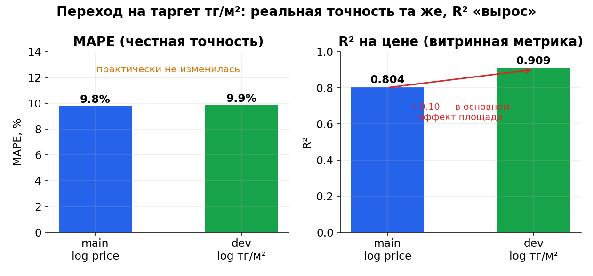
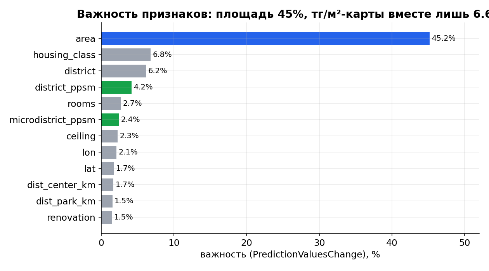
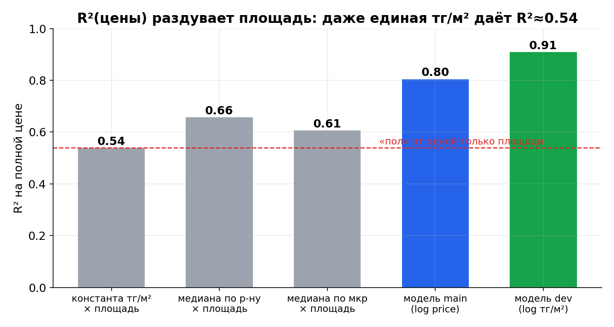
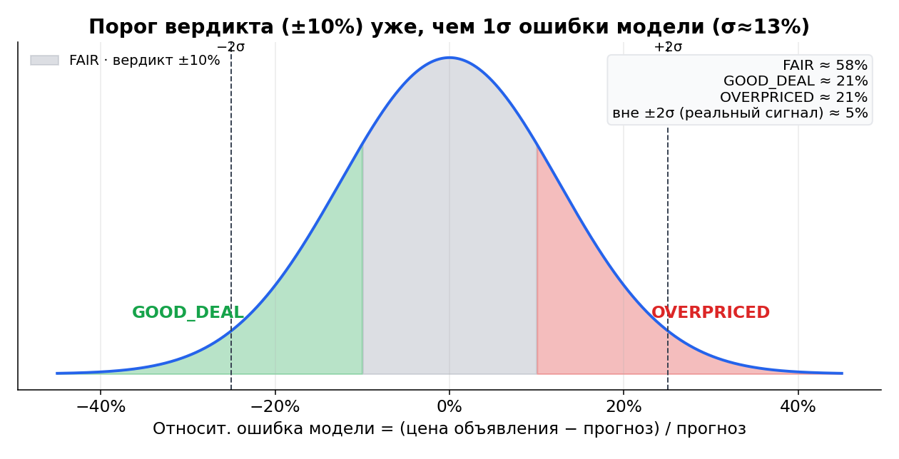

# Аудит ML-модели оценки квартир (Krisha Fair Price)

> **О чём отчёт.** Разбор, почему модель «ощущается глупой», хотя её метрики выглядят
> прилично. Главный вывод: модель технически исправна, но (1) переход на таргет ₸/м²
> почти не изменил реальную точность, а (2) ощущение «глупости» создают две конкретные
> вещи — порог вердикта внутри собственной погрешности модели и обучение на ценах
> *предложения*, а не сделок.
>
> **Метод.** Прогон действующей модели (`models/model.cbm`) на отложенной выборке,
> сравнение метрик веток `main`/`dev` из `model_meta.json`, анализ важности признаков,
> дублей и «умных» бейзлайнов. Все цифры воспроизводимы скриптами из этого репозитория.
>
> **Метка данных.** Технические суждения о библиотеках/методах помечены `[data: 2025]`
> (год моих знаний). Пункты `[verify]` стоит перепроверить веб-поиском перед действием.

---

## 1. Резюме

- **Что оценивалось:** одна модель `CatBoostRegressor` (~7k объявлений, 44 фичи, 13 категориальных),
  обёрнутая в FastAPI + Telegram-бот. Ветки `main` (таргет `log(цена)`) и `dev` (таргет `log(цена/м²)` + smearing).
- **Состояние:** модель **исправна и небесполезна** — MAPE ~10%, что вдвое лучше наивного
  «медиана ₸/м² × площадь» (~17–21%). Это не таблица-справочник. Проблема не в качестве кода,
  а в дизайне таргета метрик и в логике вердикта.
- **Сильные стороны:** грамотный лог-таргет со smearing-коррекцией; ppsm-карты считаются
  только на train (без утечки в метрики); единая точка фичей для train и predict; реальная
  инженерия (25 тестов, CI, SHAP, гео-фичи, деплой).
- **Слабые стороны:** вердикт выносится внутри погрешности модели; ориентир на R² (раздутая
  метрика); обучение на asking-ценах; случайный сплит вместо временного; 7k из ~40k данных.
- **Топ проблемы по серьёзности:** вердикт-в-шуме (8/10); потолок «asking ≠ сделка» (7/10);
  R² как метрика прогресса (6/10).

---

## 2. Сильные стороны (что сделано правильно)

1. **Лог-таргет + smearing-коррекция Дуана.** На `dev` обратное преобразование сделано через
   `expm1(pred) · S`, где `S = mean(exp(остатки))` считается **только на train**. Это снимает
   систематическое занижение цены при `expm1` (неравенство Йенсена) — деталь, которую в
   pet-проектах почти всегда забывают. Здесь `S ≈ 0.99993`, т.е. смещение фактически нулевое,
   но сам механизм корректен. `[data: 2025]`
2. **Нет утечки в метрики через ppsm-карты.** `compute_ppsm_maps` вызывается на train-части
   до построения фичей, и эта же карта применяется к test. Частая ошибка (считать медианы по
   всему датасету) здесь не допущена.
3. **Единая функция фичей для обучения и инференса** (`build_features` / `listing_to_frame`).
   Train и predict не разъезжаются — типичный источник «модель в проде врёт» закрыт by design.
4. **CatBoost — адекватный выбор.** Табличные данные, смешанные типы, категории высокой
   кардинальности (ЖК, микрорайоны), ordered target encoding из коробки. `[data: 2025]`
5. **Модель реально работает.** На отложенной выборке она примерно вдвое точнее наивного
   бейзлайна (см. §4.2). Признаки осмысленные: площадь, класс жилья, район, гео.
6. **Инженерия выше среднего для pet-проекта:** 25 тестов / 10 файлов, CI (ruff + pytest),
   SHAP-объяснения, гео-фичи из OSM, деплой на Railway, Telegram-бот, аккуратный README.
7. **Сильное ТЗ** (`docs/TZ_AVM_improvements.md`): KNN-цена, квантильные интервалы и риски
   (дедуп, smearing, валюта) уже описаны — фундамент для улучшений заложен.

---

## 3. Слабые стороны по серьёзности

Шкала 1–10 (10 = критично для качества продукта).

| # | Область | Находка | Серьёзность | Где |
|---|---------|---------|:----------:|-----|
| 1 | Вердикт/Продукт | Порог вердикта ±10% **уже**, чем σ ошибки модели (~12–13%). Большинство ярлыков «выгодно/дорого» — внутри собственного шума модели | **8** | `predict.py` `VERDICT_THRESHOLD` |
| 2 | Постановка | Обучение на ценах **предложения**, а не сделок → «справедливая цена» = «типичная цена объявления», а не рыночная стоимость | **7** | данные / `train.py` |
| 3 | Метрики | R² как метрика прогресса вводит в заблуждение: он раздут умножением на площадь (см. §4.3) | **6** | `train.py` `evaluate` |
| 4 | Валидация | Случайный train/test split на дрейфующем рынке → holdout оптимистичен; перезаливы (1.7%) слегка протекают | **5** | `train.py` `train_test_split` |
| 5 | Данные | 7k из доступных ~40k → высокая дисперсия в редких корзинах (ppsm по мкр шумнее, чем по р-ну) | **5** | `data/krisha.db` |
| 6 | Выдача | Отдаётся точка, а не диапазон — нет слоя неопределённости | **6** | `predict.py` `fair_price` |
| 7 | Данные | Валюта (часть цен привязана к $) не зафиксирована на дату публикации → шум в таргете | **4** | скрейпер / `clean` |
| 8 | Данные | Нет дефлятора/временной фичи при накоплении истории — старые объявления искажают цену | **4** | фичи |

---

## 4. Детали диагностики

### 4.1 Переход на ₸/м² почти не дал реального прироста

Сравнение метрик из `model_meta.json` обеих веток:

| Ветка | Таргет | MAPE | R²(цена) | MAE | Обучена на |
|-------|--------|:----:|:--------:|----:|:----------:|
| `main` | `log(цена)` | **9.81%** | 0.804 | 7.18 млн ₸ | 7 047 |
| `dev` | `log(цена/м²)` + smearing | **9.89%** | 0.909 | 6.24 млн ₸ | 8 131 |

Честная метрика (MAPE) **не сдвинулась** — и это при том, что `dev` обучен на бóльшем
объёме данных (8 131 против 7 047). Рост R² 0.80 → 0.91 выглядит как «модель поумнела»,
но это **витрина** (см. §4.3), а не точность. Отсюда твоё ощущение «сделал по м², а лучше
не стало» — оно корректное.

> ⚠️ Сравнение не идеально чистое: ветки обучены на **разном** объёме данных. Чтобы закрыть
> вопрос окончательно — переобучить оба таргета на одних данных и одном сплите (см. §6).
> Сам по себе таргет ₸/м² теоретически чище (дисперсия стабильнее, RMSE на логе ≈ оптимизация
> относительной ошибки) — это **не ошибка**, просто не та ручка, что чинит «глупость».

### 4.2 Модель — не «справочник»: она бьёт наивный бейзлайн

«Умные» бейзлайны без всякого ML на той же отложенной выборке:

| Метод | MAPE | R²(цена) |
|-------|:----:|:--------:|
| константа ₸/м² (медиана города) × площадь | 21.1% | 0.539 |
| медиана ₸/м² по **району** × площадь | 17.5% | 0.657 |
| медиана ₸/м² по **микрорайону** × площадь | 18.5% | 0.607 |
| **модель CatBoost** | **~9.8%** | 0.80 |

Модель примерно вдвое точнее лучшего наивного эвристика — значит, она действительно учит
премии/скидки, а не просто перемножает медиану на площадь. Любопытно: медиана по
**микрорайону** *хуже* медианы по **району** (18.5% vs 17.5%) — в редких микрорайонах мало
объявлений, медиана шумная. Это прямой аргумент за добор данных и за KNN-цену соседей.

Важность признаков действующей модели:

Площадь — 45%, дальше класс жилья, район, ₸/м²-карты (вместе лишь 6.6%), комнаты, потолки,
координаты, расстояния. Распределение здоровое: модель опирается на множество факторов, а не
на одну ppsm-подсказку.

### 4.3 R²(цена) раздут площадью — это обманчивая метрика прогресса

Даже **единая** цена за м² для всего города, умноженная на площадь, даёт R²(цена) ≈ **0.54**.
То есть больше половины «объяснённой дисперсии» полной цены — это просто знание площади
квартиры, а не заслуга модели. Когда таргет = ₸/м², а прогноз цены = `pred × площадь`,
умножение на (известную) площадь автоматически поднимает R² на полной цене. Поэтому
R² 0.91 на `dev` — в значительной мере артефакт реконструкции, а не реальный скачок точности.

**Вывод:** перестать ориентироваться на R²(цена) как на главную метрику. Честнее: **MdAPE**
(медианная абс. % ошибка, устойчива к выбросам), **доля прогнозов в ±10%**, и MAPE на шкале
₸/м². `[data: 2025]`

### 4.4 Почему модель ощущается глупой — причина №1: вердикт внутри шума

Порог вердикта (`VERDICT_THRESHOLD = 0.10`) определяет «выгодно/справедливо/дорого». Но
типичная относительная ошибка модели — MAPE ~10%, что соответствует σ ошибки ≈ **12–13%**.
То есть **порог вердикта уже, чем одно стандартное отклонение собственной ошибки модели**.

Следствия (для ~нормальной ошибки с σ≈12.5%):
- ~58% квартир попадают в «справедливо» — для них сервис просто говорит «цена ≈ прогнозу»;
- оставшиеся ~42% получают ярлык «выгодно/дорого», но он почти весь **внутри погрешности**;
- надёжный сигнал (отклонение > 2σ, т.е. > ~25%) — лишь у **~5%** объявлений.

Проще говоря: у границы вердикт — это подброс монетки на шуме модели. Пользователь видит
«выгодно −11%» там, где это с тем же успехом ошибка прогноза, — отсюда чувство «модель глупая».

> Косвенное подтверждение шумности валидации: если прогнать сохранённую модель на свежем
> случайном сплите текущей (чуть изменившейся) БД, MAPE падает до ~7.4% — это **оптимистично**,
> потому что часть строк, на которых модель обучалась, попадает в «тест». Честная цифра из
> `model_meta.json` — ~9.8–10%. Это ещё один довод за временной (time-based) сплит.

### 4.5 Причина №2: «справедливая цена» = «типичная цена объявления»

Модель обучена на ценах **предложения** (asking) с Krisha, а не на ценах **сделок**. Значит
прогноз — это «за сколько выставили бы похожую квартиру», а не «сколько она реально стоит».
Последствия:
- если переоценён весь сегмент, модель этого **не увидит** — она считает переоценку нормой;
- вердикт меряет отклонение от **соседей по объявлениям**, а не от рыночной стоимости;
- модель не видит того, что объясняет разброс **внутри** корзины (реальное состояние, вид из
  окна, срочность продавца, качество фото, юридическая чистота) → прогноз схлопывается к
  средней по корзине → ярлык «FAIR» у большинства.

Это **потолок постановки**, а не баг. Никакой таргет и никакие фичи того же типа его не
пробьют — нужны данные о сделках/снижениях цены/времени экспозиции (частично — Этап 4 роадмапа).

### 4.6 Дубли и перезаливы — не главная проблема

Проверка по отпечатку `(коорд, площадь, комнаты, этаж)`:
- уникальных квартир: 6 990 из 7 052;
- групп с >1 объявлением: 58 (120 строк, **1.7%**); из них 26 — та же квартира с разной ценой;
- при случайном сплите в «тест» протекает 13 из 1 411 строк (**0.9%**).

Утечка от дублей сейчас мала и метрики не ломает. Но при добавлении **KNN-цены соседей** она
становится критичной (сосед-перезалив = модель списывает ответ у самой себя), поэтому дедуп по
координатам+площади+этажу нужно сделать **до** KNN. В твоём ТЗ это уже отмечено — правильно.

---

## 5. Быстрые победы (до дня работы)

- **Не выносить категоричный вердикт в «серой зоне».** Даже без новой модели: если
  `|Δ| < ~13%` (≈ σ ошибки) — показывать «в пределах рынка», а резкие «выгодно/дорого»
  оставить для `|Δ|` за пределами ~1.5–2σ. Мгновенно убирает ощущение «глупого» вердикта. (сев. 8)
- **Сменить headline-метрику** с R²(цена) на **MdAPE + доля в ±10%** (и MAPE на ₸/м²). Решения
  об улучшениях принимать по ним. (сев. 6)
- **Дедуп перезаливов** по `(коорд, площадь, этаж)` перед обучением/сплитом. (сев. 5)
- **Уточнить формулировку на фронте/в боте:** «типичная цена для похожих *объявлений*», а не
  «рыночная стоимость» — честно и снимает завышенные ожидания. (сев. 4)

## 6. Структурные задачи (больше дня)

- **Диапазон вместо точки (Задача 3 ТЗ) — поднять в приоритете выше KNN.** Две квантильные
  модели (`Quantile:alpha=0.1/0.9`) или conformal-интервал; вердикт выносить только когда цена
  объявления выходит за интервал. Это прямое лекарство от причины №1. `[data: 2025]`
- **KNN-цена соседей + иерархический target-encoding (Задача 2.1)** — основной буст MAPE, но
  строго без утечки (дерево соседей только на train, дедуп заранее). Уже начато в
  `feat/knn-price-geo`.
- **Данные 7k → ~40k + временной (time-based) сплит + дефлятор/курс валют.** Снизит дисперсию и
  даст честную оценку качества под прод.
- **Честное A/B веток:** переобучить `log(цена)` и `log(цена/м²)` на **одних** данных и **одном**
  сплите, сравнить MdAPE и долю в ±10% — и зафиксировать, какую ветку мерджить.
- **Если нужна рыночная стоимость, а не asking** — собирать сигналы сделок: история снижений
  цены, время на рынке, факт делистинга (Этап 4 роадмапа).

---

## 7. Что перепроверить веб-поиском (пробелы знаний)

- `catboost latest version best practices 2025 2026`
- `conformal prediction regression library MAPIE 2025`
- `Krisha.kz listing price currency tenge usd 2026`
- `OSM Overpass API rate limit bulk queries 2025`
- `Zillow Zestimate off-market MAPE benchmark` (для калибровки ожиданий по потолку точности)

## 8. Что НЕ вошло в аудит

- Безопасность/секреты, полное сканирование зависимостей на CVE, надёжность скрейпера, фронтенд
  и код бота, рантайм-производительность.
- Покрытие тестов измерено только по числу файлов (25 тестов / 10 файлов), не по % строк.
- Честное переобучение веток на одном сплите (требует ресурсов — вынесено в §6).
- LLM-флаги описаний (`llm_flags.py`) и их вклад в качество не оценивались.
